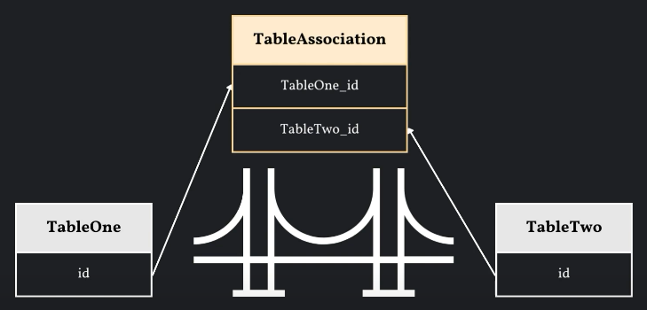
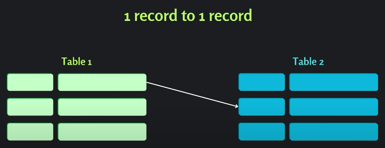
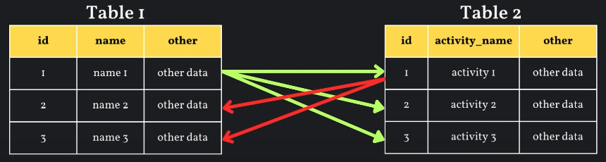

# 什麼是 ORM ?
ORM（對象關係映射）是指將資料庫表格映射到 Python 對象的過程，讓我們得以透過操作 Python 對象來操作資料庫。

# 關於 ORM 的一些基本概念:
__類(Model Class):__ 在 SQLAlchemy 中，類是用來表示資料庫表格的 Python 類別，每個類都會對應資料庫中的一個表格

__列(Column):__ 列是類中的屬性，用來表示資料庫表格中的列。在 SQLAlchemy 中，可以使用 Column 類別來定義列、指定列的類型和約束等等資訊

__關係(Relationship):__ 關係是用來描述類之間的關聯關係，例如一對多、多對一、一對一等等。在 SQLAlchemy 中，可以使用 relationship 函數來定義關係，指定外鍵信息

__會話(Session):__ 會話是用來管理與資料庫的交互，物件導向程式可以透過會話執行查詢、添加、修改、刪除等等操作，並將這些操作同步到資料庫中

__映射(Mapping):__ 映射是指將類和資料庫表格進行對應關聯的過程。在 SQLAlchemy 中，這個過程式自動完成的，透過定義類和使用類的方式，SQLAlchemy 可以根據類自動生成與之對應的資料庫表格結構

# 使用 SQLAlchemy 的基本步驟
## __Step 1 創建引擎(Engine)__
引擎是用於連接資料庫，我們使用 `create_engine` 來在指定位置上創建資料庫
```python
engine = create_engine('sqlite:///example.db')
```

## __Step 2 創建會話(Session)__
會話是用於執行資料庫操作的，這邊使用 `sessionmaker` 這個函數來創建會話對象
```python
Session = sessionmaker(bind=engine)
```

## __Step 3 定義類(Model Class)__
類是用來表示資料庫的表格結構。在類中，需要使用 Column 來定義列，並使用 relationship 來定義表格之間的關係

### 定義類的方式有幾種可以選擇:
1. 使用 Column Class 和簡單的 relationship 方法
```python
# 創建基類
Base = declarative_base()

# 定義類
class Address(Base):
    __tablename__ = "addresses"

    city = Column(String)
    state = Column(String)
    zip_code = Column(Integer)
    user_id = Column(ForeignKey("members.id"))

    def __repr__(self):
        return f"<Address(id = {self.id}, city = {self.city})>"

class Member(Base):
    __tablename__ = "members"

    name = Column(String)
    age = Column(Integer)
    addresses = relationship(Address)

    def __repr__(self):
        return f"<Member(id = {self.id}, username = {self.name})>"

# 創建資料庫表格
Base.metadata.create_all(engine)
```

2. 在 relationship 方法中使用 back_populates 這個引數來允許反向關係
```python
# 創建基類
Base = declarative_base()

# 定義類
class Address(Base):
    __tablename__ = "addresses"

    city = Column(String)
    state = Column(String)
    zip_code = Column(Integer)
    user_id = Column(ForeignKey("members.id"))
    user = relationship("User", back_populates = "addresses")

    def __repr__(self):
        return f"<Address(id = {self.id}, city = {self.city})>"

class Member(Base):
    __tablename__ = "members"

    name = Column(String)
    age = Column(Integer)
    addresses = relationship(Address)

    def __repr__(self):
        return f"<Member(id = {self.id}, username = {self.name})>"

# 創建資料庫表格
Base.metadata.create_all(engine)
```

3. 使用 Mapped Class
```python
# 創建基類
Base = declarative_base()

# 定義類
class Address(Base):
    __tablename__ = "addresses"

    city = Column(String)
    state: Mapped[str] = mapped_column()
    zip_code: Mapped[int] = mapped_column()
    member_id: Mapped[int] = mapped_column(ForeignKey("members.id"))
    member: Mapped['Member'] = relationship(back_populates = "addresses")

    def __repr__(self):
        return f"<Address(id = {self.id}, city = {self.city})>"

class Member(Base):
    __tablename__ = "members"

    name = Column(String)
    age = Column(Integer)
    addresses: Mapped[list["Address"]] = relationship()

    def __repr__(self):
        return f"<Member(id = {self.id}, username = {self.name})>"

# 創建資料庫表格
Base.metadata.create_all(engine)
```

Mapped 方法可以定義的資料格式:
- bool: 用於 Boolean 型態的資料
- byte: 用於 LargeBinary 型態的資料
- datetime.date: 用於 Date 型態的資料
- datetime.datetime: 用於 DateTime 型態的資料
- datetime.time: 用於 Time 型態的資料
- datetime.timedelta: 用於 Interval 型態的資料
- decimal.Decimal: 用於 Numeric 型態的資料
- float:用於 Float 型態的資料
- int: 用於 Integer 型態的資料
- str: 用於 String 型態的資料
- uuid: 用於 UUID 型態的資料
  
我們可以在 Base 類中定義資料型態縮寫所代表的資料型態，舉例來說，如果在 Base class 中寫入如下的程式碼:
```python
class Base(DeclarativeBase):
    type_annotation_map = {
        int: BIGINT,
    }
```
之後如果在類中的屬性寫入 `Mapped[int]` 就會表示該欄位的資料型態為 BIGINT

我們也可以自定義資料格式，寫法如下:
```python
from sqlalchemy import String, create_engine
from sqlalchemy.orm import DeclarativeBase, mapped_column, Mapped, registry
from typing import Optional
from typing_extensions import Annotated

engine = create_engine("sqlite:///database.db", echo = True)

# Annotated 是用於創建帶有元數據註釋的數據類型輔助工具，其作用是將類型標註與其他元數據信息與數據類型相關聯
str_20 = Annotated[str, 20]
str_100 = Annotated[str, 100]

class Base[DeclarativeBase]:
    # 註冊類型註解和相應的數據庫資料型態的映射關係
    registry = registry(
        type_annotation_map = {
            str_20: String(20),
            str_100: String(100),
        }
    )

class UserLegacy(Base):
    __tablename__ = 'users'

    id: Mapped[int] = mapped_column(primary_key = True)
    first_name: Mapped[Optional[str_20]]
    last_name: Mapped[Optional[str_100]]
```
上面建立基類和 Annotated 的部分可以改寫成下面的方式，結果會是一樣的:
```python
str_20 = Annotated[str, mapped_column(String(20))]
str_100 = Annotated[str, mapped_column(String(100))]

class Base(DeclarativeBase):
    pass
```
之後的使用方式與上面的方式相同，會得到相同結果

我們也可在 Annotated 中定義 Optional，如下程式碼:
```python
str_20 = Annotated[Optional[str], mapped_column(String(20))]
str_100 = Annotated[str, mapped_column(String(100))]

class Base(DeclarativeBase):
    pass

class UserLegacy(Base):
    __tablename__ = 'users'

    id: Mapped[int] = mapped_column(primary_key = True)
    first_name: Mapped[str_20]
    last_name: Mapped[Optional[str_100]]
```

4. 使用 `mapped_column` 方法

```python
from sqlalchemy import Column, Integer, String, create_engine
from sqlalchemy.orm import declarative_base, mapped_column

# 設置 echo=True 將啟用引擎的日誌功能，這將會標準化顯示引擎所執行的所有 SQL 語句
engine = create_engine("sqlite:///database.db", echo = True)

# 創建基類
Base = declarative_base()

# 定義類
class Address(Base):
    __tablename__ = "addresses"

    city = mapped_column(String)
    state = mapped_column(String)
    zip_code = mapped_column(Integer)
    member_id = mapped_column(Integer, ForeignKey("members.id"))
    member = relationship('Meber', back_populates = "addresses")

    def __repr__(self):
        return f"<Address(id = {self.id}, city = {self.city})>"

class Member(Base):
    __tablename__ = "members"

    name = mapped_column(String)
    age = mapped_column(Integer)
    addresses = relationship(Address)

    def __repr__(self):
        return f"<Member(id = {self.id}, username = {self.name})>"

# 創建資料庫表格
Base.metadata.create_all(engine)
```
:sunny: __mapped_column() 所建立的表格和 Mapped[data_type] 所建立的表格有什麼差異 ?__
>Mapped[data_type] 所建立的表格預設為 NOT NULL
>而 mapped_column() 所建立的則不會有這樣的預設
>如果 Mapped[data_type] 所建立的表格不希望預設為 NOT NULL，可以改寫為以下寫法:
```python
class Address(Base):
    __tablename__ = "addresses"

    state: Mapped[str] = mapped_column(nullable = True) # 這個也不會預設為NOT NULL
    zip_code: Mapped[Optional[int]] = mapped_column() # 這個就不會預設為 NOT NULL
    member_id: Mapped[int] = mapped_column(ForeignKey("members.id"))
```

### 創建基類的方法:

1. 使用 declarative_base 建立

```python
Base = declarative_base()
```

2. 使用 DeclarativeBase 建立

```python
class Base(DeclarativeBase):
    pass
```

### 類的屬性
`__tablename__`: 指定資料庫表格的名稱

`__allow_unmapped__`: 表示 SQLAlchemy 會將這個類視為可映射到資料庫的類，即使其中可能包含沒有足夠映射的資訊

:sunny: __正常情況下，如果一個類沒有足夠的映射信息，SQLAlchemy 就會拋出異常，但設置` __allow_unmapped__ = True` 就可以阻止這種異常發生__

# 表格之間的關聯關係
## 表示兩個實體之間的關聯關係
### 什麼是實體 ?
實體是指在同一個表格（或實體集合）中的不同紀錄。在資料庫中，表格中的每一行都表示一個實體，表個中的每個實體可能都具有相同的結構，但具有不同的屬性值。在 ORM 中，會將表格映射為類，而每個類的實例則表示為一個實體

### 在實體中用於表示兩個實體之間的關聯關係
使用 follow 來表示實體之間的關聯關係，實際使用範例如下:
```python
# 創建基類
Base = declarative_base()

# 建立類
class Merchant(Base):
    __tablename__ = "merchants"
    __allow_unmapped__ = True

    id = Column(Integer, primary_key = True)
    merchantname = Column(String)
    following_id = Column(Integer, ForeignKey('merchants.id'))
    following = relationship('Merchant', remote_side=[id], uselist= True)

    def __repr__(self):
        return f"<Merchant(id={self.id}, merchantname={self.merchantname}, following={self.following})>"

# 創建資料庫表格
Base.metadata.create_all(engine)
```
在 Merchant Class 中的 `follow_id` 定義了一個外鍵列，用於表示商家之間的關係。它引用了同一個表中的另一個商家的 id
`following = relationship('Merchant', remote_side=[id], uselist= True)` 則定義了一個 `follow` 屬性，表示商家之間的關係
```python
# 新增資料
merchant1 = Merchant(merchantname = "Zeq Tech 1")
merchant2 = Merchant(merchantname = "Zeq Tech 2")
merchant3 = Merchant(merchantname = "Zeq Tech 3")

# 加入實例關聯關係
merchant1.following.append(merchant2)
merchant2.following.append(merchant3)

# 在會話中加入資料
session.add_all([merchant1, merchant2, merchant3])
session.commit()

# 將實例之間的關聯關係印出
print(f"{merchant1.following = }")
print(f"{merchant2.following = }")
print(f"{merchant3.following = }")
```
前面的 Merchant Class 中的 follow 屬性必須加上 `uselist = True` 才能在後面加入實例關係時使用 `.append()` 這個方法

### Circular Dependency Error
Circular Dependency Error（循環依賴錯誤）是指在程式碼中出現了循環依賴的情況，導致程式無法正確地執行或運行。這種錯誤通常發生在實體之間相互引用，導致一個實體依賴於另一個實體，而該實體又依賴於第一個實體，從而形成了循環依賴

舉例來說，如果我們將上面建立實體關聯的程式碼改寫成:
```python
merchant1.following.append(merchant2)
merchant2.following.append(merchant3)
merchant3.following.append(merchant1)
```
就會產生 Circular Dependency Error 這個錯誤

### 如何解決 Circular Dependency Error ?
一個常見的解決辦法是建立一個 關聯表(Associate Table)

關聯表有時也稱為連接表、中間表或交集表，是在資料庫設計中用於建立多對多關係的一種技術。當兩個實體之間存在多對多的關係時，通常需要使用關聯表來實現這種關係。其概念如下圖:


關聯表通常具有以下特徵：
- 包含兩個或更多的外鍵：關聯表中的每個外鍵都關聯到另一個表中的主鍵，從而建立了實體之間的關係。
- 沒有主鍵：關聯表通常不需要具有自己的主鍵，因為它主要用於建立其他表之間的關聯。
- 用於解決多對多關係：當兩個表之間存在多對多的關係時，關聯表可以用於解決這種關係，它允許將多個記錄與多個記錄進行關聯，而不需要在兩個表中添加大量的重複數據。

實際建立方式:
```python
Base = declarative_base()

class BaseModel(Base):
    __abstract__ = True
    __allow_unmapped__ = True

    id = Column(Integer, primary_key = True)

class FollowingAssociation(BaseModel):
    __tablename__ = "following_association"

    merchant_id = Column(Integer, ForeignKey('merchant.id'))
    following_id = Column(Integer, ForeignKey('merchants.id'))

class Merchant(BaseModel):
    __tablname__ = "merchants"
    merchantname = Column(String)
    following = relationship('Merchant', secondary="following_association",
                             primaryjoin=("FollowingAssociation.merchant_id == Merchant.id"),
                             secondaryjoin=("FollowingAssociation.following_id == Merchnat.id"))

    def __repr__(self):
        return f"<Merchant(id={self.id}, merchantname={self.merchantname}, following={self.following})>"

Base.metadata.create_all(engine)
```
__FollowingAssociation 類：__

`merchant_id = Column(Integer, ForeignKey('merchant.id'))`：定義一個用於存儲商家 id 的列，並將其設置為外鍵關聯到 merchant 表的 id 列

`following_id = Column(Integer, ForeignKey('merchants.id'))`：定義一個用於存儲商家所關注的商家 id 的列，並將其設置為外鍵關聯到 merchants 表的 id 列

__Merchant 類：__

`following = relationship('Merchant', secondary="following_association", primaryjoin=("FollowingAssociation.merchant_id == Merchant.id"), secondaryjoin=("FollowingAssociation.following_id == Merchant.id"))`：定義了與其他商戶的關注關係。透過 `relationship` 函數來建立對 Merchant 類的關聯。`secondary` 參數指定了用於建立多對多關係的關聯表，`primaryjoin` 參數指定了關聯表中商戶ID與商戶表中ID之間的關聯條件，`secondaryjoin` 參數指定了關聯表中商戶關注ID與商戶表中ID之間的關聯條件。

## 一對一的表格關係(One-on-One Relationship)
一對一的表格關係是指兩個表格之間每一筆紀錄的關聯是一個對應一個，其關係如下圖:



範例程式碼請查看 one_on_one_relationship.py

## Self Relationship
自我關係（self relationship）是指在資料庫中的表格中，同一表格中的一行數據與該表格中的其他行數據之間建立關聯的概念。這邊每個紀錄之間的關聯就像是 Linked-List 這種資料型態一樣，會有一個指針指向下一個與當前紀錄有關聯的紀錄位置

範例程式碼請看 self_relationship.py

## 多對多表格關係(Many-to-Many Relationship)
多對多表格關係是指兩個表格之間的每一筆紀錄都對應上多筆紀錄，其關係如下圖:



範例程式碼請看 many_to_many_relationship.py

# Relationship Loading
在 SQLAlchemy 中，relationship loading 是一種技術，當兩個對象之間存在關係時，relationship loading 允許我們在需要時自動加載相關對象，以方便數據的訪問和操作。

## relationship loading 的模式：
### eager loading（急切加載）
當我們訪問對象的某個屬性時，ORM 立即從數據庫中加載相關的對象，並將它們關聯到原始對象中。這樣可以減少數據庫查詢的次數，提高性能。在 SQLAlchemy 中，我們可以通過在定義 relationship 時設置 lazy 參數為 select 或 joined 來實現急切加載。

__lazy 參數值為 select 時:__
  
表示在訪問關聯對象時將使用 SELECT 查詢立即加載相關對象。這意味著當訪問對象的關聯屬性時，ORM 將執行一個額外的 SELECT 查詢，以立即從數據庫中加載相關的對象

優點:
- 可以減少懶加載的性能開銷
- 提供即時訪問關聯對象的能力
- 適用於相關聯物件內容不多的情境
  
缺點:
- 性能影響：雖然 lazy='select' 可以提供即時訪問，但它會在訪問關聯對象時立即執行額外的 SELECT 查詢，這可能會增加請求的執行時間和數據庫負載。
- N+1 問題：如果在迭代大量對象時頻繁訪問關聯對象，可能會導致 N+1 問題，即每個對象都需要執行一個額外的 SELECT 查詢，這可能會導致性能問題。
- 數據重複：每次訪問關聯對象時都會執行 SELECT 查詢，這可能會導致數據重複和不必要的查詢。
- 加載過度：如果關聯對象很大或數量很多，立即加載所有相關對象可能會導致性能問題和資源消耗。 

__lazy 參數值為 selectin 時:__

表示當我們訪問關聯屬性時，SQLAlchemy 會使用一個帶有 IN 子句的 SELECT 查詢來檢索所有相關對象，以及它們的關聯對象。

優點：
- 減少查詢次數：當訪問關聯對象時，使用一個帶有 IN 子句的 SELECT 查詢來檢索相關對象，從而避免了多次單獨的 SELECT 查詢。這樣可以減少與數據庫的交互次數，從而提高效率
- 提高緩存利用率：一個大的 SELECT 查詢結果比多個小的 SELECT 查詢更容易被緩存。這樣可以減少從數據庫檢索數據的次數，從而提高查詢速度
- 減少往返延遲：一個較大的 SELECT 查詢可能需要較長的時間才能從數據庫獲取所有相關對象。然而，一旦獲取了這些對象，它們將被保存在緩存中，並且後續的訪問將不再需要額外的往返延遲
- 可以避免 N+1 問題
- 比起 lazy = select 執行效率更加
  
缺點:
- 當數據量龐大時，執行速度慢且效率差
- 在執行加載時，整個資料庫表格中的紀錄都會被加載到記憶體中
  
__lazy 參數值為 joined 時:__

表示當我們訪問該屬性時，SQLAlchemy 會立即使用 JOIN 操作將相關對象加載到內存中，也就是說 SQLAlchemy 會在一個單獨的 SELECT 查詢中檢索相關對象，並使用 JOIN 操作將它們加載到內存中，從而獲得相關對象的完整集合

優點：
- 減少往返延遲：所有相關對象都在一個查詢中檢索，從而減少了與資料庫的交互次數
- 提高效率：通過使用 JOIN 操作，可以在一個操作中檢索相關對象，從而提高了查詢效率
- 減少 N+1 問題：因為它在一個查詢中檢索了所有相關對象，而不是在每個父對象上進行單獨的查詢
  
缺點：
- 較大的查詢負擔：如果相關對象的數量很大，一個大的 JOIN 操作可能會增加查詢的負擔，尤其是在較大的數據集上
- 內存消耗：將所有相關對象加載到內存中可能會消耗大量的內存，尤其是當相關對象的數量很大時

__lazy 參數值為 raise 時:__

表示當我們訪問該屬性時，如果尚未加載相關對象，就會引發 LazyLoadError 異常。這個設置確保了在訪問關聯對象之前，必須明確地加載它們，從而防止意外的懶加載。

當我們要要求資料時，可以在程式碼中使用 `.joinedload` 這種預加載技術，將需要的關聯對象預先加載起來。舉例來說:
```python
teachers = session.query(Teacher).options(joinedload(Teacher.sensitive_informations)).all()
```
這段程式碼是表示當 SQLAlchemy 執行查詢時須預先加載 Teacher 對象的 sensitive_information 這個關聯對象

__lazy 參數值為 subquery 時:__

表示每次訪問關聯屬性時，SQLAlchemy 會執行一個額外的子查詢，以檢索相關對象。

優點:
- 避免將整個主查詢的結果中的每個行逐一與相關對象進行匹配，而是通過一個額外的子查詢將相關對象檢索出來，可以提高性能

__lazy 參數值為 write_only時:__

指定關聯屬性在將數據寫入數據庫時才會進行加載，而在讀取數據時不會自動加載相關對象

WriteOnlyCollection 物件可以使用的方法為以下幾種:
`add()`、`add_all()`、`delete()`、`insert()`、`remove()`、`select()`、`update()`

__lazy 參數值為 dynamic 時:__

lazy='dynamic' 可以改變關聯屬性的行為方式。當我們設置關聯屬性的 lazy 參數為 dynamic 時，該屬性將返回一個特殊的查詢對象，而不是立即加載所有相關對象。

具體來說，當你訪問這個關聯屬性時，不會立即發出 SQL 查詢去加載相關對象，而是返回一個 Query 對象，你可以在這個對象上進行進一步的查詢操作

好處:
- 可以根據需要定製你的查詢，只在需要時才實際加載相關對象，從而提高效率並節省資源

### Deferred Loading(延遲加載)
是一種延遲加載數據的技術，它允許在需要時才從資料庫中檢索數據，而不是在對象被實例化時例集加載所有數據

優點:
- 減少資料庫負載: 僅在需要時才從資料庫中檢索數據，可減少不必要的資料庫查詢
- 提高性能：延遲加載可以延遲數據的檢索，因為不需要立即加載所有相關數據，因此初始化對象的過程更快
- 節省內存: 只有在需要時才會加載數據，可以節省內存空間

在 SQLAlchemy 中，透過設置 lazy 參數為 deferred 來實現延遲加載，當我們訪問隊象的延遲加載屬性時，SQLAlchemy 將會在需要時執行額外的數據庫查詢以檢索數據

範例程式碼請看 deferred_loading.py

__`group` 參數__

用來將具有相似加載需求的屬性分在同一組，以便在需要時一起加載。例如下面的範例程式碼:
```python
class UserLegacy(Base):
    __tablename__ = 'userlegacies'

    id: Mapped[int] = mapped_column(primary_key = True)
    nickname: Mapped[str] = mapped_column(String)
    first_name: Mapped[str] = deferred(mapped_column(String), group = "names")
    last_name = deferred(Column(String), group = "names")
    other_value: Mapped[str] = mapped_column(String, deferred = True, deferred_group = "other")

    def __repr__(self) -> str:
        return f"<UserLegacy: {self.id} - {self.nickname}>"

Base.metadata.create_all(engine)

user = session.query(UserLegacy).first()
# 如果在查詢語句中加入 `undefer_group` 表示在查詢對象時取消延遲查詢加載的特定分組，也就是說，在返回的對象中，相應分組的屬性會立即被加載，而不會延遲加載
other_user = session.query(UserLegacy).options(undefer_group("names"), undefer_group("other")).first()
print(other_user)
print(other_user.first_name)
print(other_user.last_name)
print(other_user.other_value)
```

__`raiseload` 參數__

如果 ORM 嘗試訪問相關對象，但這些對象尚未被加載時，就會引發異常，而不是自動執行額外的查詢來加載這些對象。這可以幫助開發人員及時發現可能存在的性能問題，並確保不會在不需要的時候加載大量數據。以下為範例程式碼:
```python
class UserLegacy(Base):
    __tablename__ = 'userlegacies'

    id: Mapped[int] = mapped_column(primary_key = True)
    nickname: Mapped[str] = mapped_column(String)
    first_name: Mapped[str] = deferred(mapped_column(String), raiseload = True)
    last_name = deferred(Column(String), raiseload = True)
    other_value: Mapped[str] = mapped_column(String, deferred = True, deferred_raiseload = True)

    def __repr__(self) -> str:
        return f"<UserLegacy: {self.id} - {self.nickname}>"

Base.metadata.create_all(engine)

user = session.query(UserLegacy).first()
print(other_user)
print(other_user.first_name)
print(other_user.last_name)
print(other_user.other_value)
```

# 查詢
__`session.scalar()`__

用於執行查詢並返回單個標量值，通常用於執行聚合函數（如COUNT、SUM等）或返回單個值得查詢。下面為範例程式碼:
```python
user = User(name = 'Zeq Tech', posts = [Post(content = "This is some content")])
session.add(user)
session.commit()

user = session.scalar(select(User))
print(f"\nUser {user.id}: {user.name} - {user.posts} \n")
```

__`session.query()`__
用於從資料庫中檢索數據。它返回一個 Query 對象，該對象包含了構建查詢的相關信息。下面是範例程式碼:
```python
user = User(name = 'Zeq Tech', posts = [Post(content = "This is some content")])
session.add(user)
session.commit()

user = session.query(User).first()
print(f"\nUser {user.id}: {user.name} - {user.posts} \n")
```

:sunny: __`.scalar()` 和 `.query()` 兩個方式的差異:__
>`query()` 方法可以與各種過濾器、連接、排序和其他查詢操作一起使用，以建構複雜的查詢語句。其所返回的結果是一個查詢結果集，資料結構可以是列表、元組或其他資料結構
>
>`scalar()` 方法用於從查詢結果中提取出單個值，而不是整個結果集。其返回的資料結構類型可以是數字、字串或其他單個數據類型

# 不同類型的 Join
### Inner Join
顯示的資料在指定的兩個表格中都存在

### Anti Inner Join
顯示的資料為指定的兩個表格中，除了交集的部分以外

### Left Join
只顯示左邊表格內的資料

### Outer Join
顯示指定的兩個資料表中的其中一個，但不包括兩者之間共同擁有的資料

### Full Outer Join
所指定的兩個表格內的資料都有被包含。SQLAlchemy 並沒有直接支援 Full Outer Join，而是採用 Union 的方式來設計

# 參考資料
[Python SQLAlchemy ORM](https://www.youtube.com/playlist?list=PLKm_OLZcymWhtiM-0oQE2ABrrbgsndsn0)