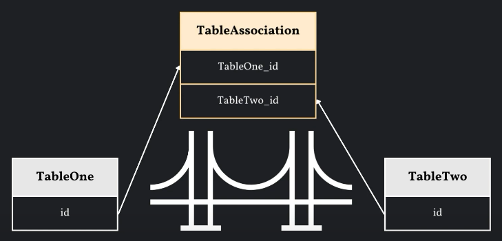

# 什麼是 ORM ?
ORM（對象關係映射）是指將資料庫表格映射到 Python 對象的過程，讓我們得以透過操作 Python 對象來操作資料庫。

# 關於 ORM 的一些基本概念:
__類(Model Class):__ 在 SQLAlchemy 中，類是用來表示資料庫表格的 Python 類別，每個類都會對應資料庫中的一個表格

__列(Column):__ 列是類中的屬性，用來表示資料庫表格中的列。在 SQLAlchemy 中，可以使用 Column 類別來定義列、指定列的類型和約束等等資訊

__關係(Relationship):__ 關係是用來描述類之間的關聯關係，例如一對多、多對一、一對一等等。在 SQLAlchemy 中，可以使用 relationship 函數來定義關係，指定外鍵信息

__會話(Session):__ 會話是用來管理與資料庫的交互，物件導向程式可以透過會話執行查詢、添加、修改、刪除等等操作，並將這些操作同步到資料庫中

__映射(Mapping):__ 映射是指將類和資料庫表格進行對應關聯的過程。在 SQLAlchemy 中，這個過程式自動完成的，透過定義類和使用類的方式，SQLAlchemy 可以根據類自動生成與之對應的資料庫表格結構

# 使用 SQLAlchemy 的基本步驟
## __Step 1 創建引擎(Engine)__
引擎是用於連接資料庫，我們使用 `create_engine` 來在指定位置上創建資料庫
```python
engine = create_engine('sqlite:///example.db')
```

## __Step 2 創建會話(Session)__
會話是用於執行資料庫操作的，這邊使用 `sessionmaker` 這個函數來創建會話對象
```python
Session = sessionmaker(bind=engine)
```

## __Step 3 定義類(Model Class)__
類是用來表示資料庫的表格結構。在類中，需要使用 Column 來定義列，並使用 relationship 來定義表格之間的關係
### 定義類的方式有幾種可以選擇:
1. 使用 Column Class 和簡單的 relationship 方法
```python
# 創建基類
Base = declarative_base()

# 定義類
class Address(Base):
    __tablename__ = "addresses"

    city = Column(String)
    state = Column(String)
    zip_code = Column(Integer)
    user_id = Column(ForeignKey("members.id"))

    def __repr__(self):
        return f"<Address(id = {self.id}, city = {self.city})>"

class Member(Base):
    __tablename__ = "members"

    name = Column(String)
    age = Column(Integer)
    addresses = relationship(Address)

    def __repr__(self):
        return f"<Member(id = {self.id}, username = {self.name})>"

# 創建資料庫表格
Base.metadata.create_all(engine)
```

2. 在 relationship 方法中使用 back_populates 這個引數來允許反向關係
```python
# 創建基類
Base = declarative_base()

# 定義類
class Address(Base):
    __tablename__ = "addresses"

    city = Column(String)
    state = Column(String)
    zip_code = Column(Integer)
    user_id = Column(ForeignKey("members.id"))
    user = relationship("User", back_populates = "addresses")

    def __repr__(self):
        return f"<Address(id = {self.id}, city = {self.city})>"

class Member(Base):
    __tablename__ = "members"

    name = Column(String)
    age = Column(Integer)
    addresses = relationship(Address)

    def __repr__(self):
        return f"<Member(id = {self.id}, username = {self.name})>"

# 創建資料庫表格
Base.metadata.create_all(engine)
```

3. 使用 Mapped Class
```python
# 創建基類
Base = declarative_base()

# 定義類
class Address(Base):
    __tablename__ = "addresses"

    city = Column(String)
    state: Mapped[str] = mapped_column()
    zip_code: Mapped[int] = mapped_column()
    member_id: Mapped[int] = mapped_column(ForeignKey("members.id"))
    member: Mapped['Member'] = relationship(back_populates = "addresses")

    def __repr__(self):
        return f"<Address(id = {self.id}, city = {self.city})>"

class Member(Base):
    __tablename__ = "members"

    name = Column(String)
    age = Column(Integer)
    addresses: Mapped[list["Address"]] = relationship()

    def __repr__(self):
        return f"<Member(id = {self.id}, username = {self.name})>"

# 創建資料庫表格
Base.metadata.create_all(engine)
```
### 類的屬性
`__tablename__`: 指定資料庫表格的名稱

`__allow_unmapped__`: 表示 SQLAlchemy 會將這個類視為可映射到資料庫的類，即使其中可能包含沒有足夠映射的資訊

:sunny: 正常情況下，如果一個類沒有足夠的映射信息，SQLAlchemy 就會拋出異常，但設置` __allow_unmapped__ = True` 就可以阻止這種異常發生

# 表格之間的關聯關係
### 表示兩個實體之間的關聯關係
__什麼是實體 ?__
實體是指在同一個表格（或實體集合）中的不同紀錄。在資料庫中，表格中的每一行都表示一個實體，表個中的每個實體可能都具有相同的結構，但具有不同的屬性值。在 ORM 中，會將表格映射為類，而每個類的實例則表示為一個實體

__在實體中用於表示兩個實體之間的關聯關係__
使用 follow 來表示實體之間的關聯關係，實際使用範例如下:
```python
# 創建基類
Base = declarative_base()

# 建立類
class Merchant(Base):
    __tablename__ = "merchants"
    __allow_unmapped__ = True

    id = Column(Integer, primary_key = True)
    merchantname = Column(String)
    following_id = Column(Integer, ForeignKey('merchants.id'))
    following = relationship('Merchant', remote_side=[id], uselist= True)

    def __repr__(self):
        return f"<Merchant(id={self.id}, merchantname={self.merchantname}, following={self.following})>"

# 創建資料庫表格
Base.metadata.create_all(engine)
```
在 Merchant Class 中的 `follow_id` 定義了一個外鍵列，用於表示商家之間的關係。它引用了同一個表中的另一個商家的 id
`following = relationship('Merchant', remote_side=[id], uselist= True)` 則定義了一個 `follow` 屬性，表示商家之間的關係
```python
# 新增資料
merchant1 = Merchant(merchantname = "Zeq Tech 1")
merchant2 = Merchant(merchantname = "Zeq Tech 2")
merchant3 = Merchant(merchantname = "Zeq Tech 3")

# 加入實例關聯關係
merchant1.following.append(merchant2)
merchant2.following.append(merchant3)

# 在會話中加入資料
session.add_all([merchant1, merchant2, merchant3])
session.commit()

# 將實例之間的關聯關係印出
print(f"{merchant1.following = }")
print(f"{merchant2.following = }")
print(f"{merchant3.following = }")
```
前面的 Merchant Class 中的 follow 屬性必須加上 `uselist = True` 才能在後面加入實例關係時使用 `.append()` 這個方法

### Circular Dependency Error
Circular Dependency Error（循環依賴錯誤）是指在程式碼中出現了循環依賴的情況，導致程式無法正確地執行或運行。這種錯誤通常發生在實體之間相互引用，導致一個實體依賴於另一個實體，而該實體又依賴於第一個實體，從而形成了循環依賴

舉例來說，如果我們將上面建立實體關聯的程式碼改寫成:
```python
merchant1.following.append(merchant2)
merchant2.following.append(merchant3)
merchant3.following.append(merchant1)
```
就會產生 Circular Dependency Error 這個錯誤

### 如何解決 Circular Dependency Error ?
一個常見的解決辦法是建立一個 關聯表(Associate Table)

關聯表有時也稱為連接表、中間表或交集表，是在資料庫設計中用於建立多對多關係的一種技術。當兩個實體之間存在多對多的關係時，通常需要使用關聯表來實現這種關係。其概念如下圖:


關聯表通常具有以下特徵：
- 包含兩個或更多的外鍵：關聯表中的每個外鍵都關聯到另一個表中的主鍵，從而建立了實體之間的關係。
- 沒有主鍵：關聯表通常不需要具有自己的主鍵，因為它主要用於建立其他表之間的關聯。
- 用於解決多對多關係：當兩個表之間存在多對多的關係時，關聯表可以用於解決這種關係，它允許將多個記錄與多個記錄進行關聯，而不需要在兩個表中添加大量的重複數據。

實際建立方式:
```python
Base = declarative_base()

class BaseModel(Base):
    __abstract__ = True
    __allow_unmapped__ = True

    id = Column(Integer, primary_key = True)

class FollowingAssociation(BaseModel):
    __tablename__ = "following_association"

    merchant_id = Column(Integer, ForeignKey('merchant.id'))
    following_id = Column(Integer, ForeignKey('merchants.id'))

class Merchant(BaseModel):
    __tablname__ = "merchants"
    merchantname = Column(String)
    following = relationship('Merchant', secondary="following_association",
                             primaryjoin=("FollowingAssociation.merchant_id == Merchant.id"),
                             secondaryjoin=("FollowingAssociation.following_id == Merchnat.id"))

    def __repr__(self):
        return f"<Merchant(id={self.id}, merchantname={self.merchantname}, following={self.following})>"

Base.metadata.create_all(engine)
```
FollowingAssociation 類：

`merchant_id = Column(Integer, ForeignKey('merchant.id'))`：定義一個用於存儲商家 id 的列，並將其設置為外鍵關聯到 merchant 表的 id 列

`following_id = Column(Integer, ForeignKey('merchants.id'))`：定義一個用於存儲商家所關注的商家 id 的列，並將其設置為外鍵關聯到 merchants 表的 id 列

Merchant 類：

`following = relationship('Merchant', secondary="following_association", primaryjoin=("FollowingAssociation.merchant_id == Merchant.id"), secondaryjoin=("FollowingAssociation.following_id == Merchant.id"))`：定義了與其他商戶的關注關係。透過 `relationship` 函數來建立對 Merchant 類的關聯。`secondary` 參數指定了用於建立多對多關係的關聯表，`primaryjoin` 參數指定了關聯表中商戶ID與商戶表中ID之間的關聯條件，`secondaryjoin` 參數指定了關聯表中商戶關注ID與商戶表中ID之間的關聯條件。